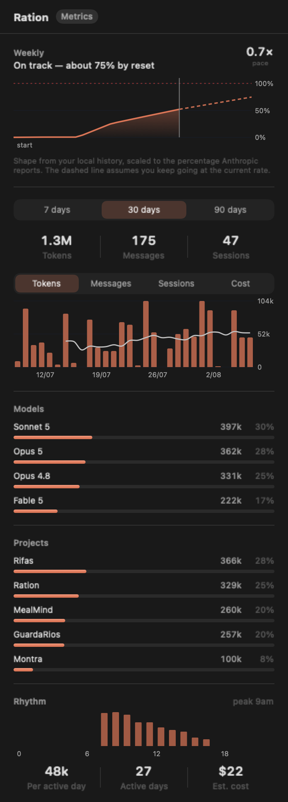

# Ration

Your Claude usage, in the macOS menu bar.

Ration puts a small gauge in your menu bar showing how much of your Claude plan
you have used. No more discovering you hit a limit halfway through a long agent
run.

<p align="center">
  
</p>

<p align="center">
  
  
  
</p>

The menu bar item carries a small bar for the weekly allowance — the limit that
creeps up on you, since a session window resets often enough to watch itself.
It turns amber past 80% and red past 90%, so you get a warning at a glance
without opening anything.

Three tabs:

- **Usage** — live plan limits, straight from Anthropic. Click any limit to promote it into the ring.
- **Activity** — a calendar heat map of the last five months, built from your local Claude Code transcripts.
- **Metrics** — where your tokens went, by model and by project, over 7/30/90 days.

- **Native.** SwiftUI `MenuBarExtra`, about 5 MB, no Electron and no runtime to install.
- **Live.** Reads the same numbers `/usage` shows inside Claude Code, refreshed in the background.
- **Quiet.** Optional notifications when you approach a limit, and nothing else.
- **Private.** No analytics, no telemetry. Two hosts, both listed below, and nothing else.
- **Self-updating.** Signed updates via Sparkle; nothing to re-download by hand.

> Ration is an independent open-source project. It is **not affiliated with,
> endorsed by, or supported by Anthropic**. "Claude" is a trademark of Anthropic.

## Install

```sh
brew install --cask mcpeixoto/tap/ration
```

Or [download the latest release](https://github.com/mcpeixoto/ration/releases/latest),
unzip, and drag `Ration.app` to your Applications folder.

### Requirements

- macOS 14 (Sonoma) or later
- [Claude Code](https://claude.com/claude-code), signed in

Ration does not sign you in and has no account of its own. It reads the session
Claude Code already has.

## How it works

**Live limits (the Usage tab).**

1. Claude Code stores your login session in the macOS keychain under
   `Claude Code-credentials`.
2. Ration reads the **access token** from that item — nothing else.
3. It calls `GET https://api.anthropic.com/api/oauth/usage` with that token,
   which is the same endpoint `/usage` uses inside Claude Code.
4. It draws the resulting percentages in your menu bar.

**History (the Activity and Metrics tabs).** Claude Code writes a transcript of
every session to `~/.claude/projects/**/*.jsonl`. Ration reads the token counts
out of those files — and only the token counts. Your prompts, Claude's replies,
and the contents of files you opened are never decoded, never retained, and
never leave your machine. The first scan reads the whole corpus in the
background (a few seconds for a gigabyte); after that it reads only the bytes
appended since the last check.

That is the whole program.

### The keychain prompt

The first time Ration runs, macOS will ask whether it may read the
`Claude Code-credentials` keychain item:

> **Ration wants to use your confidential information stored in
> "Claude Code-credentials" in your keychain.**

This is expected. The keychain item was created by Claude Code, so its access
list does not include Ration until you say so. Click **Always Allow** and macOS
will not ask again.

Ration explains this in its welcome screen *before* triggering the prompt,
because an unexplained dialog asking about your credentials is exactly the sort
of thing you should be suspicious of.

If you would rather not grant it, close the welcome window. Ration will sit
idle and read nothing.

## What Ration does and does not do

**It does:**

- Read one keychain item, read-only.
- Send your token to exactly one host, `api.anthropic.com`, and keep it in
  memory only for that request.
- Check `raw.githubusercontent.com` for an update feed, and download releases
  from `github.com` when you install one. **Your token is never sent there** —
  update checks carry no credentials and no usage data.

**It does not:**

- Read your refresh token, your MCP server logins, or anything else in that
  keychain blob.
- Read your prompts, Claude's replies, or file contents out of your transcripts —
  only `usage`, `model`, `timestamp`, `cwd`, and `sessionId`.
- Write to your keychain, ever.
- Refresh, rotate, or invalidate your session. Only Claude Code does that. If
  your session expires, Ration says so and waits.
- Write the token to disk, to `UserDefaults`, or to a log.
- Send analytics, telemetry, or crash reports anywhere.
- Read your prompts, your conversations, or your code.

## Updates

Ration checks for updates once a day and can install them itself. Each update
is signed with an EdDSA key; the matching public key is compiled into the app,
and an update that isn't signed by the Ration key is refused — so a compromised
download host still can't ship you a modified Ration.

Turn automatic checks off in Settings if you'd rather update by hand.

## What Ration does and does not do (continued)

These are enforced by tests, not just promised in a README — see
[`Tests/RationKitTests/CredentialTests.swift`](Tests/RationKitTests/CredentialTests.swift),
which fails the build if a second network host appears in the source tree, if
networking leaks outside `LimitsClient.swift`, or if anything reads the refresh
token.

More detail in [SECURITY.md](SECURITY.md) and [PRIVACY.md](PRIVACY.md).

## Settings

| Setting | Default | Notes |
| --- | --- | --- |
| Menu bar shows | Session % | Session, Weekly, Highest, or icon only |
| Weekly usage bar | On | A small bar beside the icon, filling as the week is spent |
| Colour when near a limit | On | Amber past 80%, red past 90% |
| Check every | 60s | 30s minimum; faster while the panel is open |
| Notify near a limit | On | Fires once per threshold per window |
| Open at login | Off | Standard `SMAppService` login item |

### Why the 30-second floor

`/api/oauth/usage` is an undocumented convenience endpoint for your own
account. Ration will not poll it faster than every 30 seconds, and that floor is
enforced in code rather than left to configuration. Hammering it would risk it
being locked down for everyone.

## Building from source

```sh
git clone https://github.com/mcpeixoto/ration.git
cd ration
swift test          # 167 tests, no network, no keychain
./Scripts/bundle.sh # produces .build/Ration.app
open .build/Ration.app
```

Two helper scripts round out the workflow:

```sh
swift Scripts/make-icon.swift             # regenerates Resources/AppIcon.icns
swift run RationPreview docs/images       # regenerates the screenshots above
swift run RationPreview video && \
  ./Scripts/make-video.sh                 # regenerates the demo video and GIF
```

The icon is drawn in code, and the screenshots and demo video are rendered
frame by frame from the real SwiftUI views — the motion in the GIF above is the
app, not a mockup. Nothing here is a binary blob that drifts silently out of
date.

Requires Xcode 16 or later. There is no `.xcodeproj` — the whole repo is plain
text, and `Scripts/bundle.sh` assembles the `.app` around the SwiftPM binary.

### Layout

```
Sources/RationKit     Pure logic: models, keychain, API client, polling. No UI.
Sources/RationUI      SwiftUI views and view models.
Sources/Ration        The executable. Wiring and AppKit lifecycle only.
Sources/RationPreview Dev tool: renders the UI to PNGs. Not shipped.
Tests/RationKitTests  Unit tests with checked-in API fixtures.
```

`RationKit` imports no UI framework, so every decision Ration makes — what to
show, when to notify, when to back off — is testable without launching an app.

## Roadmap

- Burn rate and a live sparkline of the current session
- Export history as CSV
- A wider window than 90 days in Metrics

## Contributing

Issues and pull requests welcome — see [CONTRIBUTING.md](CONTRIBUTING.md).

If Anthropic would prefer this not exist in its current form, please open an
issue; I will work with you.

## Licence

[MIT](LICENSE).
