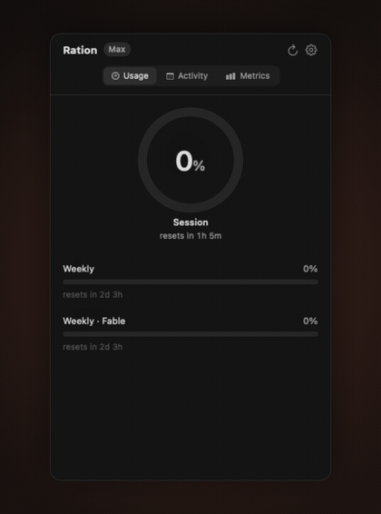
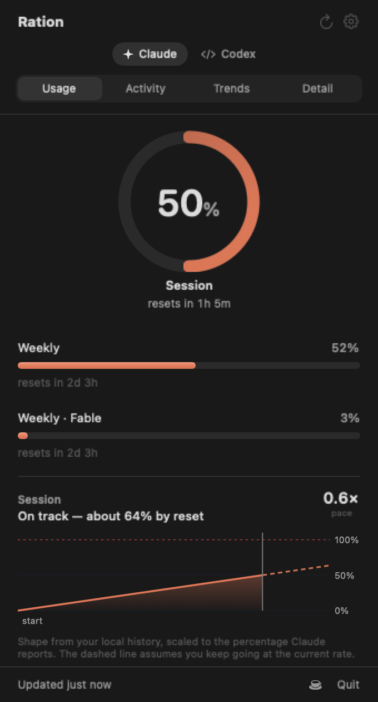
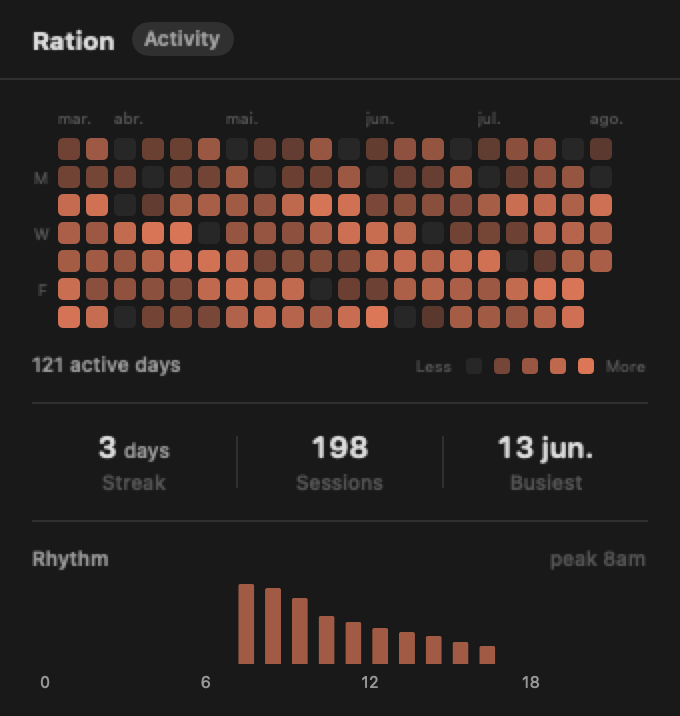
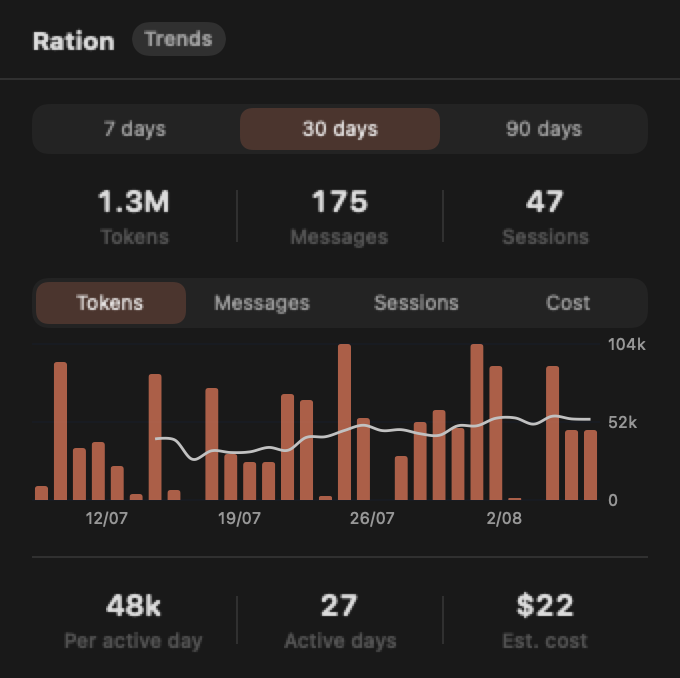
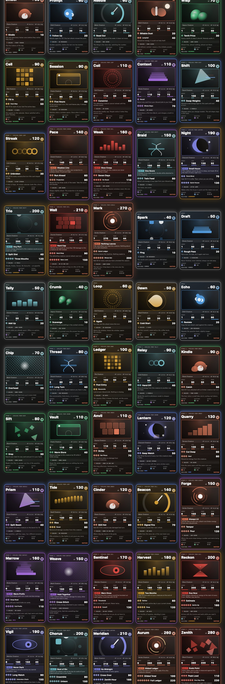

# Ration

Your AI coding usage, in the macOS menu bar — or the Linux terminal.

Ration puts a small gauge in your menu bar showing how much of your plan you
have used — for **Claude Code**, **Codex**, and **Cursor**. No more discovering you hit a
limit halfway through a long agent run.

<p align="center">
  
</p>

<p align="center">
  <a href="https://github.com/mcpeixoto/ration/releases/download/v0.6.0/ration-teaser-1x1.mp4"><b>Watch the 22-second teaser</b></a>
  &nbsp;·&nbsp;
  <a href="tools/teaser/">build it yourself</a>
</p>

<p align="center">
  
  
  
</p>

<p align="center">
  <a href="docs/images/dex-set01.jpg">
    
  </a>
</p>

The menu bar reports every account that is on. A single tool keeps the original
gauge; two or more sit side by side, each with its own symbol. A small vertical
bar tracks the weekly allowance — the limit that creeps up on you, since a
session window resets often enough to watch itself. It stays monochrome while
everything is fine, turns amber past 80% and red past 90% — so colour in your
menu bar always means something.

Four tabs, plus **Pokémon** next to the title:

- **Usage** — live plan limits, and a projection of the current window: *at
  this rate, do you run out before it resets?* Click any limit to promote it
  into the ring; the projection follows.
- **Activity** — a calendar heat map of the last five months, plus streaks and
  which hours of the day you actually work.
- **Trends** — totals and daily charts over 7/30/90 days, across
  tokens, messages, sessions, or estimated cost, with a 7-day trend line.
- **Detail** — where the tokens went, by model and by project.
- **Pokémon** — Set 01: fifty original creatures unlocked from a local Score
  across every tool Ration can read. Every card is a full trading-card face —
  evolution line, species and size, a Life / Energy / Power / Speed stat block,
  an ability on the higher rarities, attacks with energy costs, and a
  weakness / resistance / retreat footer. Cards copy, save, and post to X from
  your Mac; nothing about the collection leaves the machine unless you share
  it. On a Mac that supports Apple Intelligence, a card can be redrawn with
  Image Playground — still local.

- **Native.** SwiftUI `MenuBarExtra`, about 5 MB, no Electron and no runtime to install.
- **Live.** Reads the same numbers `/usage` shows inside Claude Code, and the
  same plan Cursor's dashboard shows, refreshed in the background.
- **Quiet.** Optional notifications when you approach a limit, and nothing else.
- **Private.** No analytics, no telemetry. Three hosts, all listed below, and nothing else.
- **Self-updating.** Signed updates via Sparkle; nothing to re-download by hand.

> Ration is an independent open-source project. It is **not affiliated with,
> endorsed by, or supported by Anthropic, OpenAI, or Anysphere**. "Claude" is a trademark of
> Anthropic; "Codex" is a trademark of OpenAI; "Cursor" is a trademark of Anysphere.

## Supported tools

| Tool | Plan gauge | History | How |
|---|---|---|---|
| **Claude Code** | yes | yes | one request to `api.anthropic.com`, using the token Claude Code already stored |
| **Codex CLI** | yes | yes | entirely from `~/.codex/sessions` — no request, no credential |
| **Cursor** | yes | yes | the session Cursor already stored on disk, then `api2.cursor.sh` for the plan gauge, burn rate, and usage log |
| GitHub Copilot | no | no | quota is only readable over the network, with a token Ration would have to mint and store itself |
| Gemini CLI | no | no | quota is only readable over the network; nothing usable is written to disk |

The last two are listed in **Settings → Accounts** with that explanation, rather
than quietly omitted. Cursor's plan percentage is not on disk — unlike Codex —
so metering it meant a second host. That change is pinned in the tests.

Codex is the interesting case: it stamps its own rate limits into every session
log it writes, so Ration reads the gauge and the history out of the same files,
with no request and no credential. The trade is freshness — those numbers age
while Codex is not running, so the panel says how old they are instead of
presenting them as live.

## Install

### macOS

[**Download Ration 0.8.3**](https://github.com/mcpeixoto/ration/releases/latest/download/Ration-0.8.3.dmg)
— open the DMG and drag `Ration.app` to Applications.

Signed with a Developer ID and notarised by Apple, so it opens without a
Gatekeeper warning. It updates itself from then on.

A Homebrew cask is coming; the formula in `Casks/` is ready but the tap is not
published yet.

### Linux

Download the x86_64 tarball from
[Releases](https://github.com/mcpeixoto/ration/releases/latest) —
`ration-0.8.3-linux-x86_64.tar.gz`. On ARM64 Linux, build from source (below).

```sh
tar -xzf ration-0.8.3-linux-x86_64.tar.gz
cd ration-0.8.3-linux-x86_64
./ration status          # one-shot usage for every tool you have
./ration watch           # refresh every 60 seconds
./ration watch --notify  # desktop alerts at 80% and 95% (needs notify-send)
./ration activity        # calendar heat map and streaks
./ration trends          # daily usage trends
./ration detail          # tokens by model and project
./ration dex             # Pokémon collection progress
./ration config show     # settings at ~/.config/ration/config.json
./ration service install # launch at login via systemd (optional)
./ration status --json   # machine-readable output
```

Or build from source:

```sh
git clone https://github.com/mcpeixoto/ration.git
cd ration
swift build -c release --product ration
.build/release/ration status
```

Linux ships as a rich CLI (`ration`), not a menu bar app. The CLI covers usage
limits, history (activity, trends, detail), the Pokémon collection, desktop
notifications via `watch --notify`, and launch-at-login via `service install`.
Sparkle auto-updates and the graphical card binder remain macOS-only.

### Requirements

**macOS**

- macOS 14 (Sonoma) or later
- At least one supported tool: [Claude Code](https://claude.com/claude-code)
  signed in, Codex CLI with at least one session, or Cursor signed in

**Linux**

- Ubuntu 22.04+ or another glibc-based distro with Swift 6
- `libsqlite3-dev` for building from source
- `libnotify-bin` (`notify-send`) for desktop alerts in `ration watch --notify`
- At least one supported tool installed and signed in (same as macOS)

On Linux, Claude Code stores credentials in `~/.claude/.credentials.json`
(respecting `CLAUDE_CONFIG_DIR` and `CLAUDE_SECURESTORAGE_CONFIG_DIR` when set).
On macOS it prefers that same file when it exists, and otherwise reads the
keychain item `Claude Code-credentials` the same way Claude Code itself does.
Cursor keeps its session at `~/.config/Cursor/User/globalStorage/state.vscdb`.

Ration does not sign you in and has no account of its own. It reads what your
tools already have.

## How it works

**Live limits (the Usage tab).**

1. Claude Code stores your login session in `~/.claude/.credentials.json` when
   that file exists, and otherwise in the macOS keychain under
   `Claude Code-credentials`.
2. Ration reads the **access token** from that store — nothing else — using
   the same path Claude Code uses, so a token refresh cannot reset Ration's
   access or sign you out.
3. It calls `GET https://api.anthropic.com/api/oauth/usage` with that token,
   which is the same endpoint `/usage` uses inside Claude Code.
4. It draws the resulting percentages in your menu bar.

**Codex, entirely from disk.** Codex CLI writes its sessions to
`~/.codex/sessions/**/rollout-*.jsonl`, and stamps its *own rate limits* into
every `token_count` record it writes — the percentage used, the window length,
and when it resets. So Ration reads the Codex gauge and the Codex history out of
the same files, with no request and no credential. It never opens Codex's
credential store; it does not need to, because even the plan tier is in the
session log. A test fails the build if any source file so much as names those
files.

The trade is freshness: a figure Codex wrote three hours ago is three hours old.
Ration timestamps the snapshot from the record rather than from the read, so the
panel says *"As of 3h ago"* instead of showing a stale number as live.

**Cursor, from the session the app already stored.** Cursor keeps its login in
a local sqlite file (not the keychain, and not your browser cookies). Ration
reads the access token and the cached plan name, then calls
`POST https://api2.cursor.sh/aiserver.v1.DashboardService/GetCurrentPeriodUsage`
— the same dashboard numbers the Cursor website shows, including the billing
window so the burn-rate card can project the month the same way it projects
Claude's session and week. It never reads a refresh secret, and it never opens
Cursor's cookie jar.

**History (the Activity, Trends and Detail tabs).** Claude Code, Codex and Cursor
write a transcript of every session — Claude Code to `~/.claude/projects/**/*.jsonl`,
Codex to `~/.codex/sessions/**/rollout-*.jsonl`. Ration reads the token counts
out of those files, and only the token counts. Your prompts, the replies, and
the contents of files you opened are never decoded, never retained, and never
leave your machine. The first scan reads the whole corpus in the background (a
few seconds for a gigabyte); after that it reads only the bytes appended since
the last check. Cursor's agent transcripts under `~/.cursor/projects` often
carry no token counts, so Ration also asks `api2.cursor.sh` for the same usage
log the dashboard shows — timestamps, model, token counts, nothing else — and
falls back to the local sqlite composer rows when that log is empty.

Each tool gets its own history, and the panel shows one at a time. Merging them
would produce a confidently wrong number: a Claude token and a Codex token are
not the same unit, and adding them up implies they are.

That is the whole program.

### The keychain prompt

Ration does not ask macOS for its own lasting grant on Claude Code's
keychain item. Claude Code replaces that item every time it refreshes the
token, which used to wipe any grant Ration had been given and bring the
login-password dialog back — and, for some people, sign them out of Claude
Code itself.

Instead Ration reads the item through `/usr/bin/security`, the same binary
Claude Code already uses. That permission survives a refresh. If
`~/.claude/.credentials.json` is present, Ration reads the file and never
touches the keychain at all.

The welcome screen still explains this before the first read. Closing it
without continuing means Ration reads nothing.

## What Ration does and does not do

**It does:**

- Read one Claude Code credential, read-only — from the credentials file when
  it exists, otherwise from the keychain item, via the same `security` CLI
  Claude Code uses.
- Read Cursor's local session file, read-only, for the access token and plan name,
  and `api2.cursor.sh` for the plan gauge, burn rate, and usage log.
- Send those tokens to the host that issued them — `api.anthropic.com` or
  `api2.cursor.sh` — and keep them in memory only for that request.
- Check `raw.githubusercontent.com` for an update feed, and download releases
  from `github.com` when you install one. **Your tokens are never sent there** —
  update checks carry no credentials and no usage data.

**It does not:**

- Read your refresh token, your MCP server logins, or anything else in that
  keychain blob.
- Touch Codex's credentials, Cursor's cookie jar, or Gemini's credential file.
  A test fails the build if a source file even names those.
- Read your prompts, the replies, or file contents out of your transcripts —
  only token counts, model, timestamp, project, and session id.
- Write to your keychain, ever.
- Refresh, rotate, or write your session. Only the tool that owns it does
  that. Ration re-reads the live store after a 401 so a rotation is not
  mistaken for a sign-out.
- Write the token to disk, to `UserDefaults`, or to a log.
- Send analytics, telemetry, or crash reports anywhere.
- Read your prompts, your conversations, or your code.

## Updates

Ration checks for updates once a day and can install them itself. Each update
is signed with an EdDSA key; the matching public key is compiled into the app,
and an update that isn't signed by the Ration key is refused — so a compromised
download host still can't ship you a modified Ration.

Turn automatic checks off in Settings if you'd rather update by hand.

## What Ration does and does not do (continued)

These are enforced by tests, not just promised in a README — see
[`Tests/RationKitTests/CredentialTests.swift`](Tests/RationKitTests/CredentialTests.swift),
which fails the build if an unexpected host appears in the source tree, if
networking leaks outside the client files, if the keychain is touched outside
`Credential+macOS.swift`, if anything reads a refresh token, or if any source file
names another tool's credential file.

Codex arrived with no new host — it is read from disk. Cursor could not be, so
`api2.cursor.sh` is on the allow-list, pinned by a test that names both of its
endpoints. That change is visible here on purpose.

More detail in [SECURITY.md](SECURITY.md) and [PRIVACY.md](PRIVACY.md).

## Settings

| Setting | Default | Notes |
| --- | --- | --- |
| Menu bar shows | Session % | Session, Weekly, Highest, or icon only — applied to every account in the tray |
| Accounts | All on | Turn a tool off and it is hidden everywhere — and not read at all. Every account that stays on appears in the menu bar. |
| Weekly usage bar | On | A small vertical gauge beside the icon, filling as the week is spent |
| Colour when near a limit | On | Amber past 80%, red past 90% |
| Check every | 60s | One minute minimum; the same interval with the panel open |
| Notify near a limit | On | Fires once per threshold per window |
| Open at login | Off | Standard `SMAppService` login item |

### Why the one-minute floor

Each tick fetches every account you have switched on, against undocumented
convenience endpoints for your own account. Ration will not poll faster than
once a minute, and that floor is enforced in code rather than left to
configuration. Hammering them would be overkill, and would risk them being
locked down for everyone.

## Building from source

**macOS**

```sh
git clone https://github.com/mcpeixoto/ration.git
cd ration
swift test          # 335+ tests, no network, no keychain
./Scripts/bundle.sh # produces .build/Ration.app
open .build/Ration.app
```

**Linux**

```sh
git clone https://github.com/mcpeixoto/ration.git
cd ration
sudo apt-get install -y libsqlite3-dev libnotify-bin   # Debian/Ubuntu
swift test
swift build -c release --product ration
.build/release/ration status
./Scripts/bundle-linux.sh                # produces release tarballs for your arch
```

To install your own build into `/Applications` instead of running it out of
`.build`:

```sh
./Scripts/install.sh                      # builds, installs, launches
DEVELOPER_ID="Developer ID Application: You (TEAMID)" \
  ./Scripts/install.sh                    # ...and signs it on the way
```

It quits any running copy first, since a bundle cannot be replaced while it is
executing. Notarisation is not part of this path and does not need to be: a
locally built app never crosses a quarantine boundary, so Gatekeeper never asks
about it. The DMG in Releases is the notarised one.

Two helper scripts round out the workflow:

```sh
swift Scripts/make-icon.swift             # regenerates Resources/AppIcon.icns
swift run RationPreview docs/images       # regenerates the screenshots above
swift run RationPreview dex .build        # regenerates the fifty-card sheet
swift run RationPreview video && \
  ./Scripts/make-video.sh                 # regenerates the demo video and GIF
```

The icon is drawn in code, and the screenshots and demo video are rendered
frame by frame from the real SwiftUI views — the motion in the GIF above is the
app, not a mockup. Nothing here is a binary blob that drifts silently out of
date.

Requires Xcode 16 or later on macOS. Linux builds need Swift 6 and
`libsqlite3-dev`. There is no `.xcodeproj` — the whole repo is plain text.

### Layout

```
Sources/RationKit     Pure logic: models, credentials, API client, polling. No UI.
Sources/RationUI      SwiftUI views and view models (macOS only).
Sources/Ration        The macOS menu bar executable.
Sources/RationCLI     The Linux (and cross-platform) CLI executable.
Sources/RationPreview Dev tool: renders the UI to PNGs. Not shipped.
Tests/RationKitTests  Unit tests with checked-in API fixtures.
```

`RationKit` imports no UI framework, so every decision Ration makes — what to
show, when to notify, when to back off — is testable without launching an app.

## Roadmap

- Burn rate and a live sparkline of the current session
- Export history as CSV
- A wider window than 90 days in Metrics

## Contributing

Issues and pull requests welcome — see [CONTRIBUTING.md](CONTRIBUTING.md).

If Anthropic would prefer this not exist in its current form, please open an
issue; I will work with you.

## Support

Ration is free and always will be. If it saved you from one mid-task limit
wall, you can [buy me a coffee](https://buymeacoffee.com/mcpeixoto) — entirely
optional, and it changes nothing about the app.

## Licence

[MIT](LICENSE).
